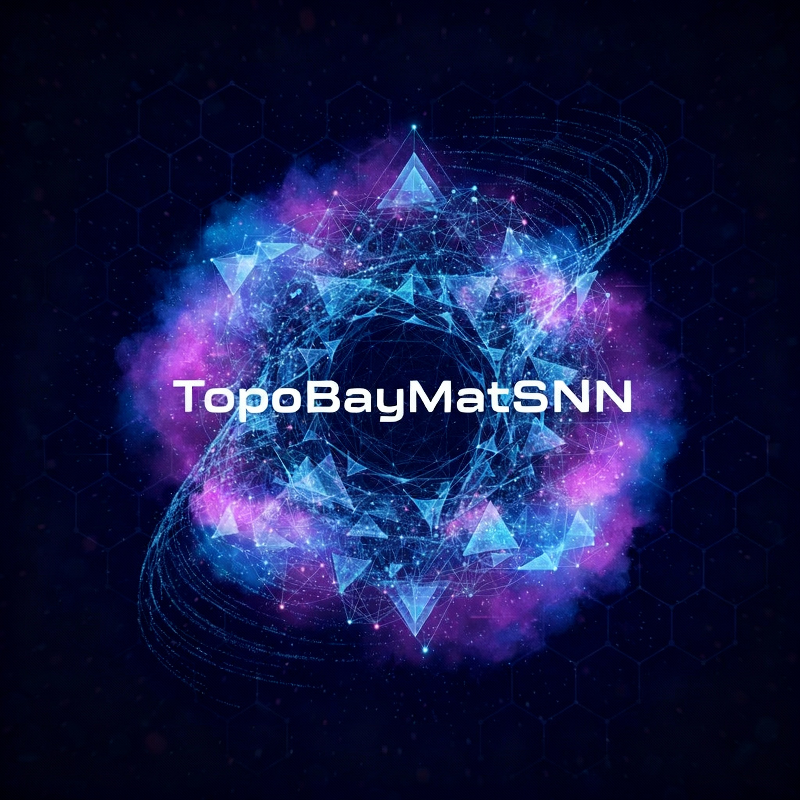
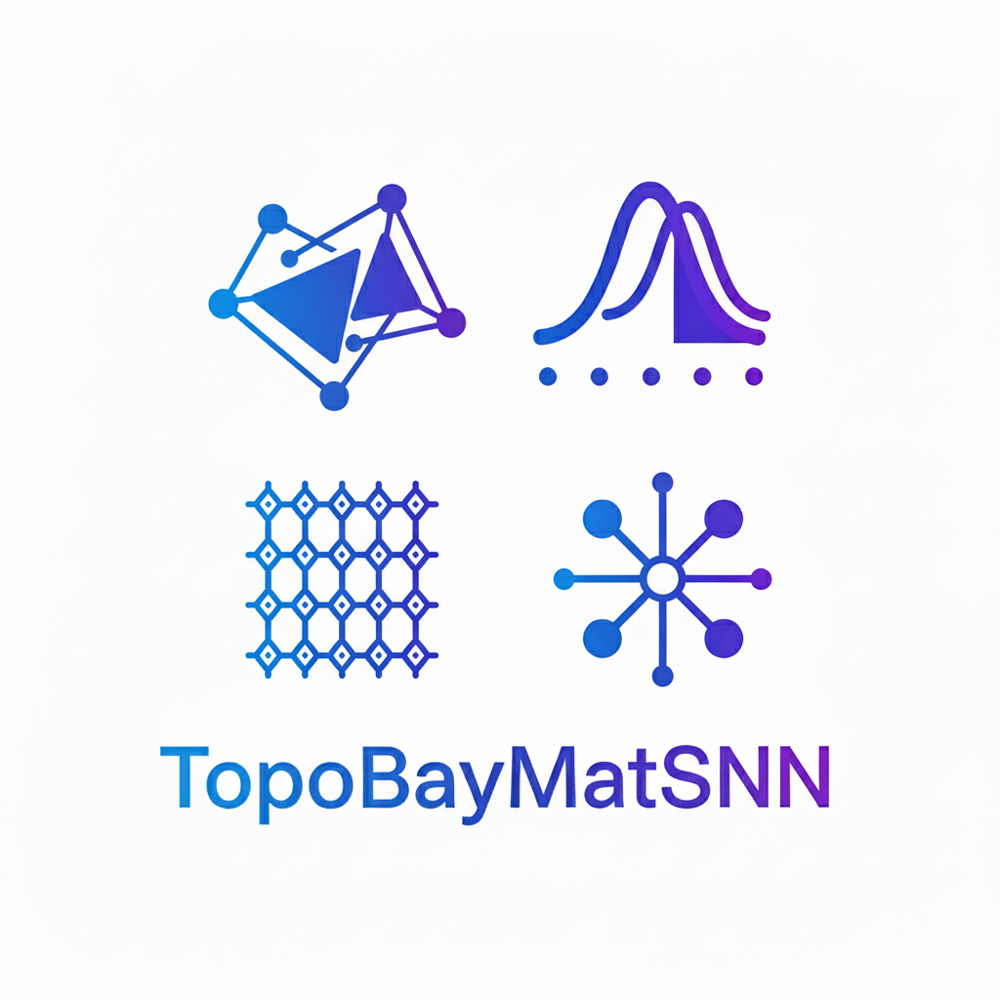

# TopoBayMatSNN-Demo (Proprietary Feature Framework)

**TopoBayMatSNN-Demo** is a demonstration version of the scientific machine learning environment tailored for modeling materials using Bayesian neural networks, topological deep learning, and simplicial neural networks.

This demo version showcases the core programming framework and structure, highlighting implementation of topological feature extraction and simplicial neural networks. **IMPORTANT: All core algorithmic details, proprietary feature names, and specific mathematical formulations related to the Topological-Quantum-Graph Fusion Descriptor (as described in the accompanying research plan) have been intentionally abstracted, simplified, or removed to protect intellectual property.** This repository focuses solely on code organization and architectural best practices.

  
  

---

*This logo symbolizes the intersection of material structure, probabilistic reasoning, topological geometry, and GNNs.*

## Demo Structure

### Model_A/
- **Features_0_Simplex.py**: Framework for 0-simplex (atomic) feature extraction. Core computations abstracted.
- **Features_1_Simplex.py**: Framework for 1-simplex (bond) feature processing.
- **Features_2_Simplex.py**: Framework for 2-simplex (triangle) topological features.
- **generate_local_tensors.py**: Template for local field tensor generation.
- **Model-A.py**: Pipeline orchestrator for simplicial feature extraction.

### Model_C/
- **src/**: Core SNN model and layers with demo implementations.
  - **simplex_data_loader.py**: Data loading framework for simplicial complexes.
  - **snn_layers.py**: Message passing layers for simplices.
  - **snn_model.py**: SNN model with Hamiltonian SDE dynamics (demo).
  - **ssl_tasks.py**: Self-supervised learning tasks (GraphMAE2 framework).
- **pretrain/**: Training script templates.
- **scripts/**: Utility scripts for embeddings.
- **test/**: Unit test placeholders.
- **validation/**: Validation script templates.
- **run.py**: Unified runner for demo functionalities.

## Usage

This demo demonstrates the modular structure for topological materials modeling. For full implementation, refer to the complete framework.

To explore the code:
1. Review Model_A for feature extraction pipeline.
2. Examine Model_C/src for SNN architecture.
3. Run demo scripts in pretrain/ and scripts/ to see framework in action (requires sample data).

Note: Data files and pre-trained weights have been removed. This version focuses on code readability and structure.

## Key Features Demonstrated

- Simplicial complex data handling (0-1-2 simplices).
- Message passing between topological dimensions.
- Hamiltonian dynamics integration with SNN.
- Self-supervised learning framework (GraphMAE2).

For production use, integrate with full datasets and train the models.
